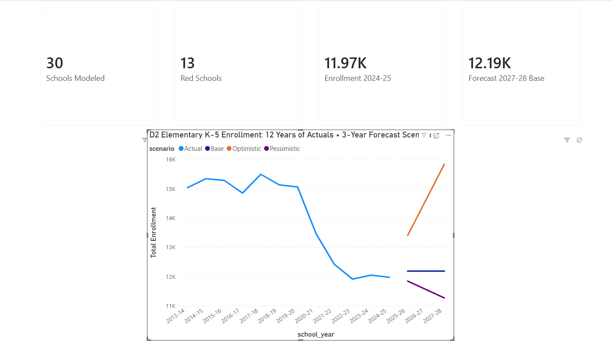
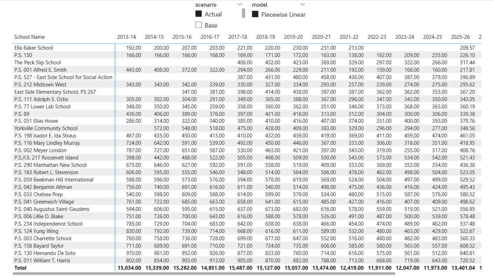
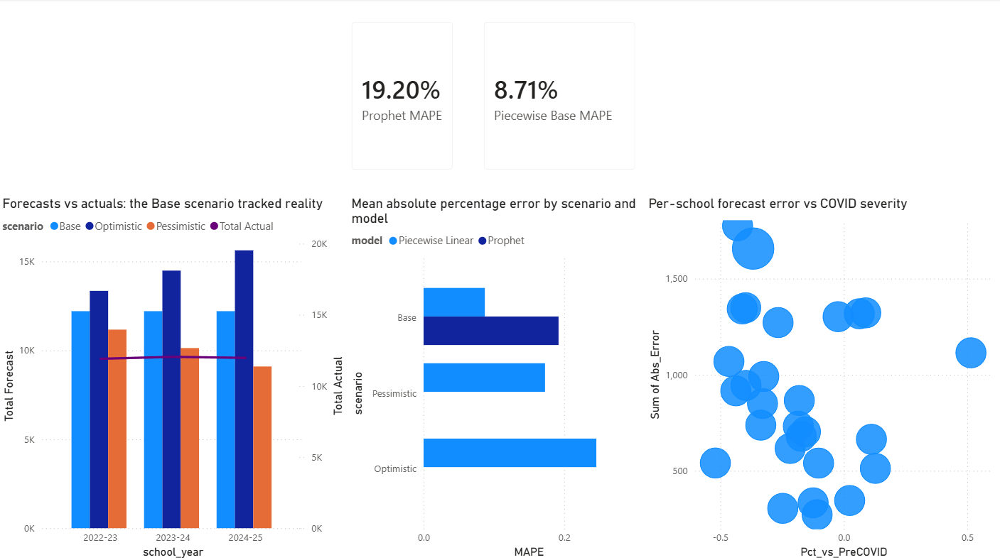

# NYC District 2 Elementary Enrollment Forecasting

> _I built a back-tested forecasting pipeline for 30 NYC public elementary schools to answer one question: do analyst-bounded scenario forecasts beat off-the-shelf ML (Prophet) at projecting post-COVID enrollment recovery? Spoiler — they did, by 2×._

**Multi-scenario enrollment forecasts for 30 NYC public elementary schools, back-tested against post-publication actuals.**

This project demonstrates a complete forecasting workflow:
1. Build three-scenario forecasts (pessimistic / base / optimistic) on 9 years of NYC DOE data
2. Compare against a Facebook Prophet baseline
3. Validate against subsequent NYSED actuals (2022-25)
4. Refit on the full 12-year dataset and generate fresh forecasts through 2027-28

> **Headline finding**: The piecewise-linear Base scenario tracked actuals within 9% MAPE. Prophet under-predicted by 19% MAPE — more than 2× the error. The methodological choice of analyst-bounded scenarios over single-point ML defaults was empirically validated.

---

## Dashboard

Built in Power BI Desktop. Three pages:

### Executive Summary
System-wide fan chart (15 years actual + 3-year forecast scenarios) with KPI cards.



### School Grid
Operational matrix of all 30 schools × 15 years, filterable by scenario and model.



### Backtest (methodology validation)
The dashboard's analytical centerpiece: forecasts vs actuals, MAPE comparison by model and scenario, per-school error scatter. The 8.71% (Piecewise Base) vs 19.20% (Prophet) cards at the top quantify the methodology comparison.



---

## Data sources

| Source | Years covered | Purpose |
|---|---|---|
| [NYC DOE Demographic Snapshot 2013-18](https://data.cityofnewyork.us/Education/2013-2018-Demographic-Snapshot-School/s52a-8aq6) | 2013-14 → 2017-18 | Historical baseline |
| [NYC DOE Demographic Snapshot 2017-22](https://data.cityofnewyork.us/Education/2017-18-2021-22-Demographic-Snapshot/c7ru-d68s) | 2017-18 → 2021-22 | Pre-COVID + COVID-period data |
| [NYSED BEDS Day Enrollment](https://data.nysed.gov/downloads.php) | 2022-23 → 2024-25 | Backtest actuals |
| [Census ACS 5-year 2022](https://api.census.gov/data/2022/acs/acs5) | 2018-22 (5-yr est) | Catchment median household income at tract level |
| [Census Geocoder](https://geocoding.geo.census.gov/geocoder/) | n/a | School lat/long → 2020 census tract mapping |

The two NYC DOE datasets stitch on the 2017-18 overlap year with byte-identical values. NYC DOE uses Oct 31 audited register counts; NYSED uses BEDS Day (first Wed of October, ~3 weeks earlier) — documented as a known methodology note.

---

## Methodology

### Primary model: piecewise linear regression

For each school we fit:

```
y_t = α + β_pre · (t - t_COVID)         (pre-COVID, t < 2020)
y_t = α + γ + β_post · (t - t_COVID)    (post-COVID, t ≥ 2020)
```

- **`β_pre`** estimated by OLS on 7 pre-COVID years (2013-14 → 2019-20)
- **`γ`** = level shock at the 2020-21 break point
- **`β_post`** estimated by OLS on 5 post-COVID years (2020-21 → 2024-25, after data refresh)

### Three scenarios (forecast horizon: 2025-26 → 2027-28)

- **Pessimistic**: continue post-COVID slope linearly
- **Base**: enrollment stabilizes at the most recent observed level
- **Optimistic**: linear recovery toward pre-COVID baseline over the horizon

### Comparison: Facebook Prophet

Configured for the data shape: no seasonality (annual data), single known changepoint at 2020-09-01, linear growth. Acts as a "modern ML default" baseline.

### Excluded / truncated schools

- **2 excluded**: The River School (02M281) and Sixth Avenue Elementary (02M340) — both phase-in schools that reached K-5 maturity in or after 2018-19, leaving no usable pre-COVID baseline.
- **4 truncated**: Yorkville (02M151), East Side (02M267), Peck Slip (02M343), PS 527 (02M527) — training data starts at their first fully-populated K-5 year.

---

## The backtest: did the methodology hold up?

Forecasts made on 2013-2022 data, tested against NYSED 2022-25 actuals.

### System-wide totals

| Year | Actual | Piecewise Base | Piecewise Optimistic | Piecewise Pessimistic | Prophet (default) |
|---|---:|---:|---:|---:|---:|
| 2022-23 | 11,911 | 12,206 | 13,347 | 11,169 | 11,154 |
| 2023-24 | 12,047 | 12,206 | 14,488 | 10,132 | 9,847 |
| 2024-25 | 11,973 | **12,206** | 15,628 | 9,095 | 8,536 |

### Error metrics (unweighted MAPE on per-school-year errors)

| Model & scenario | MAPE | Verdict |
|---|---:|---|
| **Piecewise Base** | **9.5%** | **Best in class** |
| Piecewise Pessimistic | 18.1% | Too pessimistic |
| **Prophet (default)** | **20.0%** | **Under-predicted by 28% at 3-year horizon** |
| Piecewise Optimistic | 27.0% | No recovery happened |

The Base scenario landed within 4% of system-wide reality. **The system stabilized at a new equilibrium ~25% below pre-COVID — schools neither continued declining (Prophet's projection) nor recovered (optimistic's projection). They found a new level and held it.**

This validates the methodological argument made before any actuals were available: with only 2 post-COVID data points at the original forecast date, no model could reliably distinguish "level shift" from "continuing decline." Presenting three scenarios bracketed the uncertainty; reporting a single Prophet number would have communicated a 28%-too-pessimistic projection as confident truth.

---

## Updated forecasts (refit on full 12-year data)

System-wide 2027-28 scenario range:

| Scenario | 2027-28 enrollment |
|---|---:|
| Pessimistic | 11,268 |
| **Base** | **12,186** |
| Optimistic | 15,836 |
| Prophet (refit on full data) | 10,140 |

### Risk status as of 2024-25

- **13 Red** schools (>25% below pre-COVID baseline)
- **9 Yellow** (10-25% below)
- **8 Green** (within 10% of baseline or above)

Worst declines: PS 1 Alfred E. Smith (-52%), PS 2 Meyer London (-47%), Yorkville Community (-44%), PS 130 Hernando De Soto (-43%), PS 290 Manhattan New School (-41%).

**Resilient outlier**: PS/IS 217 Roosevelt Island (+13% growth through the entire window). Geographic isolation appears to insulate this school's catchment.

---

## Driver analysis: income vs decline (the refuted hypothesis)

**Initial hypothesis**: "Wealthy downtown catchments were hit hardest by COVID." Based on the salient examples of PS 41 Greenwich Village, PS 234 Independence, PS 290 Manhattan New School — all in high-income West Village / Tribeca catchments.

**Result**: Hypothesis fails. Pearson correlation between catchment median household income and pct enrollment change is **+0.14** — essentially zero, and slightly in the wrong direction.

| Income quartile | Mean income | Mean enrollment decline |
|---|---:|---:|
| Q1 (lowest, Chinatown / LES) | $69K | **-24.2%** (worst) |
| Q2 | $125K | -16.7% (best) |
| Q3 | $151K | -20.1% |
| Q4 (highest) | $195K | -17.3% |

The **lowest-income quartile** had the largest declines, not the highest. This is consistent with public reporting on Chinatown depopulation during COVID — Asian-American families specifically had elevated outflows that don't fit the "wealthy fled to suburbs" narrative.

This is a case study finding I value: **hypothesis tested, hypothesis refuted, narrative updated to fit the data.**

---

## Repository structure

```
enrollment-forecast/
├── README.md                          (this file)
├── CASE_STUDY_OUTLINE.md              (case study writeup outline)
├── D2_Elementary_Enrollment_Forecast.pbix  (Power BI Desktop dashboard)
├── screenshots/                        (dashboard screenshots)
│
├── scripts/                            (numbered analysis pipeline, 01 → 16)
│   ├── 01_profile.py
│   ├── 02_d2_elementary.py
│   ├── 03_covid_shape.py
│   ├── 04_stitch_check.py
│   ├── 05_stitch.py
│   ├── 06_phase_in_check.py
│   ├── 07_piecewise_linear.py
│   ├── 08_prophet.py
│   ├── 09_powerbi_model.py
│   ├── 10_school_zip_mapping.py
│   ├── 11_acs_join.py
│   ├── 12_fix_tract_matches.py
│   ├── 13_inspect_nysed.py
│   ├── 14_extract_recent_actuals.py
│   ├── 15_backtest_and_reforecast.py
│   └── 16_rebuild_powerbi_model.py
│
└── data/
    ├── raw/                                (source NYC DOE / NYSED files)
    │   ├── demographic_snapshot.csv               (NYC DOE 2017-22)
    │   ├── demographic_snapshot_2013_2018.csv     (NYC DOE 2013-18)
    │   ├── school_locations.csv                   (NYC DOE school directory)
    │   └── nysed/                                 (NYSED BEDS Day enrollment, see .gitignore)
    │
    ├── derived/                            (intermediate joins + lookups)
    │   ├── d2_elementary_dbns.csv          (32 D2 elementary DBNs)
    │   ├── d2_elementary_9yr.csv           (9-year K-5 time series)
    │   ├── d2_elementary_12yr.csv          (12-year stitched K-5 time series)
    │   ├── d2_elementary_timeseries.csv    (long-format time series)
    │   ├── school_tract_mapping.csv        (school → 2020 census tract)
    │   ├── school_income.csv               (school → ACS median household income)
    │   └── acs_manhattan_income.csv        (ACS 5-year 2022, all Manhattan tracts)
    │
    ├── output/                             (model output)
    │   ├── forecasts_piecewise.csv         (per-school forecasts, all scenarios)
    │   ├── forecasts_prophet.csv           (Prophet comparison)
    │   ├── school_summary_piecewise.csv    (per-school driver decomposition)
    │   ├── schools_excluded.csv            (2 excluded schools + reason)
    │   └── backtest.csv                    (2022-25 forecasts vs actuals)
    │
    └── powerbi/                            (star schema imported by the dashboard)
        ├── fact_forecasts.csv              (706 rows: school × year × scenario × model)
        ├── fact_backtest.csv               (348 rows: backtest forecasts vs actuals)
        ├── dim_school.csv                  (32 schools with attributes)
        └── dim_year.csv                    (15 years with flags)
```

---

## How to reproduce

Requires Python 3.10+. All scripts use repo-relative paths and run on macOS,
Linux, or Windows from a fresh clone.

```bash
# 1. Install dependencies
pip install pandas numpy statsmodels scipy prophet access-parser

# 2. Get a Census API key (free, instant): https://api.census.gov/data/key_signup.html
#    macOS / Linux:
export CENSUS_API_KEY="your-key-here"
#    Windows PowerShell:
#    $env:CENSUS_API_KEY = "your-key-here"

# 3. (Optional, only for scripts 13-16) Drop the three NYSED .accdb files into
#    data/raw/nysed/ — see data/raw/nysed/README.md for download instructions.
#    Scripts 01-12 + 15-16 run without them.

# 4. Run the pipeline (each script is self-contained and idempotent)
python scripts/01_profile.py
python scripts/02_d2_elementary.py
# ... through scripts/16_rebuild_powerbi_model.py
```

All inputs and outputs live under `data/`. The scripts resolve their paths
relative to the repo root via `scripts/paths.py`, so no editing is needed
after cloning.

The Power BI dashboard imports the four star-schema CSVs from `data/powerbi/`:
- `fact_forecasts.csv`, `fact_backtest.csv`, `dim_school.csv`, `dim_year.csv`

Open `D2_Elementary_Enrollment_Forecast.pbix` in Power BI Desktop. Refresh imports to point to your local copies if needed.

---

## Limitations

- **Topcoding at $250,001** for catchment income suppresses variation at the high end.
- **Catchment income ≠ student family income.** NYC school choice means student bodies don't match catchment demographics perfectly.
- **Two data sources stitched** (NYC DOE pre-2022, NYSED post-2022) with a known snapshot-date difference (~3 weeks). Differences are small (~1-2%) but real.
- **Two schools excluded** (River, Sixth Avenue) — reached K-5 maturity too recently to forecast.
- **One backtest gap**: Ella Baker (02M225) didn't appear in NYSED 2022-25 — possible BEDS code change or school restructure.

---

## What I'd build next

- **Family-level attrition risk model**. School-level forecasts say *how many*; family-level would say *who* and *why*, where intervention dollars actually go.
- **Spatial features and capacity utilization**. The Roosevelt Island finding suggests *friction of exit* — not income — is the variable that matters. A catchment isolation index would test this directly.
- **Continue the validation cycle**. Pull 2025-26 actuals once published (~late 2026) and re-validate the 2027-28 forecasts.
